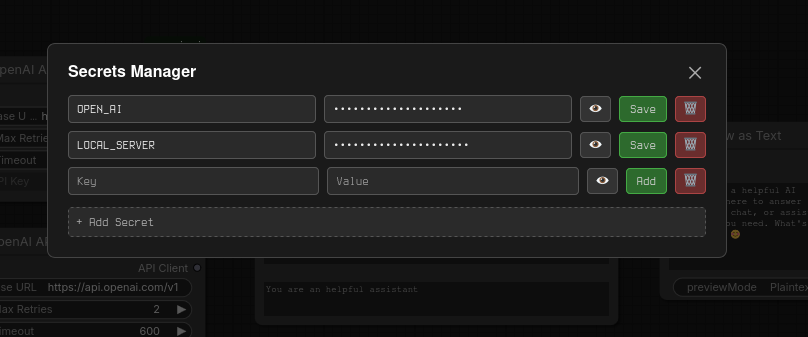
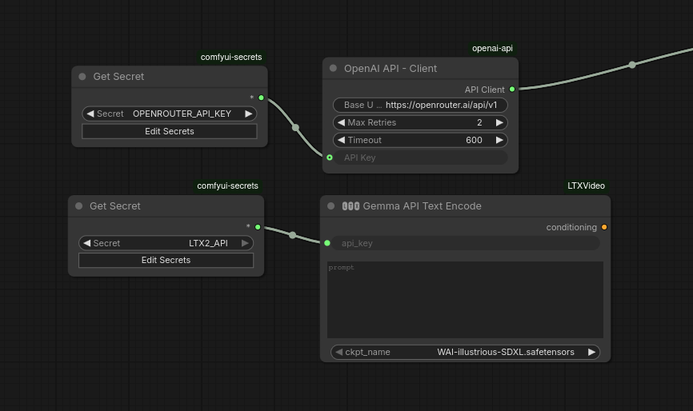

# comfyui-secrets

Manage API keys and other secrets inside ComfyUI without hardcoding them into your workflows. Allow for sharing workflows without leaking your keys.

Secrets are stored locally in `secrets.json` next to the node.

## Secrets Manager

A panel accessible directly from the frontend lets you add, update, and delete secrets. Values are masked by default with a toggle to reveal them.



## Get Secret Node

The **Get Secret** node exposes a dropdown of your stored secrets and outputs the value as a string. Wire it into any input that expects an API key or token.

Use the `Edit Secrets` button to open the manager without hunting through menus.



## Installation

Clone into your ComfyUI `custom_nodes` directory:

```bash
cd custom_nodes
git clone https://github.com/your-username/comfyui-secrets
